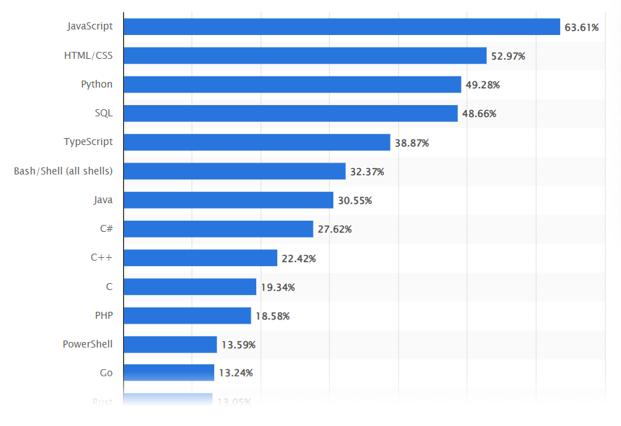

# JAVASCRIPT

---

**Helloooooowww !!!!!**
Welcome to the fist day of your Javascript journey !

This is going to be a tough one ! :O

But worry not ! We will be at your side all along the path !

---

You can do wonderful things with Javascript !

From animations, interactions, games, calls to external databases (API)... all the way to configure a server, handle authentication, communicate and transfer database information...

Javascript is the base for React, Vue and Angular with what you can do powerful web applications ! But also : mobile applications and even desktop apps ! (Did you know VS Code is done in javascript with a framework called Electron ?)

Javascript is the most used and in demand programming language in the world. Here is the list of the most used languages among developers worldwide in 2023 :

---

### But, what is Javascript ?

**Javascript** is a programming language that can be executed by the browser.

Actually, Javascript is the **ONLY** programming language that can be executed by the browser.

HTML and CSS are read and interpreted by the browser, but they are not a programming language (that contains logical operations and executions).

### Why do we need it ?

HTML and CSS are static content that we deliver to a browser. Javascript is the only way we have to change the page dynamically without changing the original html and css files.

### Application and use cases

Among many other things, here is a little list of certain application and use cases of javascript in the frontend field :

- Update displayed data behind the scenes (ex: weather data, stocks data, chat messages, etc.) (_That's what happens in all weather and live stock websites_)
- Display or use a timer. (_Think of a bank website that shows you how long you've been connected_)
- Validate user inputs and show error message with specific styling to the element.
- You can reorder, hide / show or remove elements on the screen (_Think of drag-and-drop lists_)

But ! (there is always a but...) Before we start doing amazing things with JavaScript, we need to really **understand how Javascript works and how to think logically as a programmer**.

Are you ready ??
Let's go !!!!

---

There is gonna be a markdown document for each step. I recommend you read everything and do the exercises, as well as following the videos provided.
