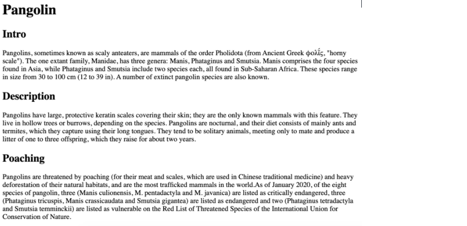
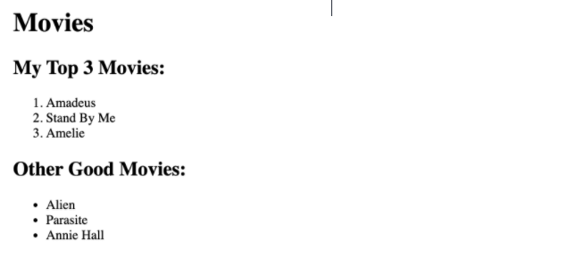
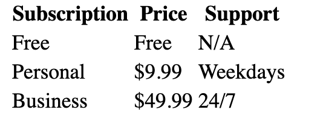
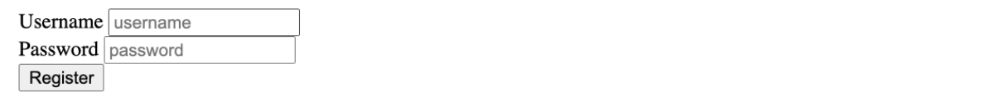

## HTML

- Type of challenge: **exercise solo**
- Duration: **2h30**

---

1. **_Pangolin exercise_**
   Let's get a little bit of practice with heading and paragraph elements. Copy the html-exercises-assets/pangolin.txt content into an html file. Please add in the appropriate paragraph and heading elements to recreate what is shown in this image:

---

2. **_Favorite Movies Exercises_**
   It's time to practice working with ordered and unordered lists. Copy the html-exercises-movies.txt content into an html file. Please add on to the markup to recreate the two lists in the following image.

   

---

3. **_Wolf Images & Links Exercise_**
   Let's get some practice with HTML Images and Anchor Elements. In a html file, please do the following:

Create an image element using this source: https://upload.wikimedia.org/wikipedia/commons/5/5f/Kolm%C3%A5rden_Wolf.jpg

The image element should be clickable in order to redirect us to https://en.wikipedia.org/wiki/Wolf in a new tab

Make sure to include some alt text on the image!

---

4. **_Snowman Logo Exercise_**
   Write an `<h1>` element to recreate the following image:

There is a snowman entity code. Find it! (you will need to google it)

Use the registered trademark entity code (the circled R at the end) , AND be sure to make it superscript

Note: No one expects you to memorize any of the entity codes. Get used to googling them! It's normal!

---

5.  **_Table Practice Exercise_**
    It's time to get some practice with all those table-related elements! (yikes) Your goal is to create a 3x3 table, with proper headings. (so it's really 4x3 if you count the heading cells) I've provided you with some starter data in html-exercises-tables, though you do not have to use it. Just make sure you create a 3x3 table with a row of headings at the top, using the correct semantic elements. You are expected to use the following elements: table, thead, tr, th, tbody, and td

Here is what the table would look like with the starter data provided :

---

6. **_Forms Practice Exercise_**
   Let's get some practice with forms, inputs, labels, and buttons! Write a simple form with the following inputs:

   1. Username

      a. Text Input

      b. Should have placeholder text of 'username'

      c. Make sure to properly label the input (using id/for attributes)

   2. Password

      a. Password Input

      b. Should have placeholder text of 'password'

      c. Make sure to properly label the input (using id/for attributes)

   3. A Button
      a. With the inner text 'Register'

I added in some `
` elements for spacing, but you don't need to:

---

7. Just for practice, inspect a website on Chrome and play around changing tags, meta title, content of the texts, etc. Get to know the inspector !

---
