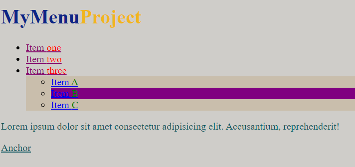

## CSS - Exercises for the videos

---

### Selectors and colors

- In your terminal, create a folder `myCssExercises`.
- Inside of it, create a folder `selectorsAndColors`
- Still with the terminal, create in one command `index.html` and `styles.css`
- Open the folder in your VS Code
- Create a boilerplate html (try to do it yourself or use the emmet shortcut  `!` but make sure you understand each markup inside of it - title, meta tags, etc.)
- Link the file styles.css to the html
- Copy the following code inside the body tag :

`<header id="header"> <h1 class="brand">MyMenuProject</h1> <ul class="menu"><li><a href="#">Item one</a></li><li><a href="#">Item two</a></li><li><a href="#">Item three</a>
<ul><li class="blabla"><a href="#">Item A</a></li><li><a href="#">Item B</a></li><li><a href="#">Item C</a></li></ul>
</li></ul></header>

Lorem ipsum dolor sit amet consectetur adipisicing elit. Accusantium,
reprehenderit!
<a href="#">Anchor</a>
`

- Format it, for the love of God !
- DON'T touch the HTML anymore. Work only in the styles.css from now on
- Make the body background color 39°, 6%, 83% (hsl)
- Make the `h1` the color 12, 37, 134 (rgb)
- Make the word `Project` the color #d69e36 (hex)
- Make the anchor tags of the first level of the menu the color 134, 12, 110 (rgb).
  - Tip : you will need to select the `a`  direct descendent of the `li` that are direct descent of the `menu`
- Make the color of the spans inside the anchor tags of the first level of the menu "red".
- Make the dropdown background color 39, 21%, 73% (hsl)
- Make the color of the spans inside the anchor tags of the second level of the menu 14, 86, 96 (rgb)
- Make the second `li` element of the second level of the menu background color `purple` (NO pseudo selectors !!!!!)
- Make all elements inside the `content` class dark cyan (use the VS Code color picker) in one only declaration

Our beautiful result should look like this :

