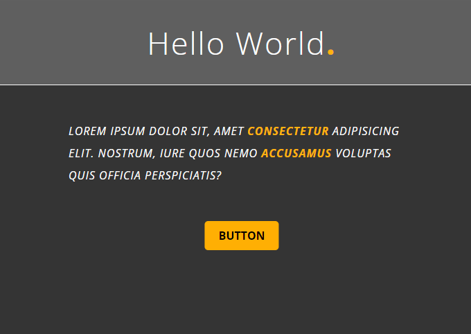

### Box model, Text and font and Hover, hyperlinks.

Make sure you understand :

- The box model (content/padding/border/margin)
- The block and inline concepts
- The browser default styling and why it's important to perform a reset through the css.
- The concept of box-sizing
- The border, padding and margin shorthands
- The concept of border radius
- The concept of
  - Font size
  - Text-decoration
  - Line height
  - Letter spacing
  - Text transform
  - Font-style
  - External fonts
- How to include an external font from Google
- How the anchor tags have default behavior and how to overwrite them
  - text-decoration
  - color
- The pseudo classes :
  - hover
  - active
  - visited
  - focus

#### Exercise: 

- Inside the folder `myCssExercises`, create a folder `boxTextHover` (terminal !!!!)
- Inside of it, `index.html` and `styles.css`
- Create a boilerplate for the html and link the css stylesheet.
- In the CSS file, perform a small reset. For absolutely everything in the document, there should be :
  - No default margins
  - Box sizing should be border-box (do you know why ? what's the difference ?)
- Via CSS, import the Open Sans font from Google Font. (select the weights 300,400 and 700)
- Set all elements inside the body to have this font.
- Give for the background of the page the color 52, 52, 52 and the color of the text white
- In the HTML, create an h1 with the text `Hello world.` (don't forget the dot)
- Bellow it, create a paragraph with a 17 word lorem ipsum (use emmet)
- Bellow it, create an achor tag that points to `#` and the text should be `button`
- Attention : the html will be modified by you later in order to tweak some things.
- In the CSS, give the h1 a background of 99, 95, 95
- Make it be centered
- Give it some padding (30px)
- The size of the font should be 45px
- Letter spacing 2px
- Thin font weight
- finally, give it a white border in the bottow of 1px solid
- Make the dot bold and with color #ffb30e
- The paragraph should be 50px bellow the h1
- It should have a maximum width of 500px
- The text block should be centered in the page
- letter spacing of 1px
- a line height of two times the font-size
- It should be uppercase and italic
- Select two random words in the paragraph and make it bold (700) and color #ffb30e
- For the anchor tag :
  - Should be 50px under the paragraph
  - Make it black and background #ffaf03
  - No underline !
  - Give a padding of 10px top and bottom and 20px left and right
  - A border radius of 5px
  - Make it uppercase
  - Make it bold
  - Center the button in the page (you'll get a problem… there are some hack/solutions to make it centered)
  - Make the hover background color of the button #fbca62
- Your result should look like this :

Done ? Congratulations ! Go ahead with the other videos and excercises !

