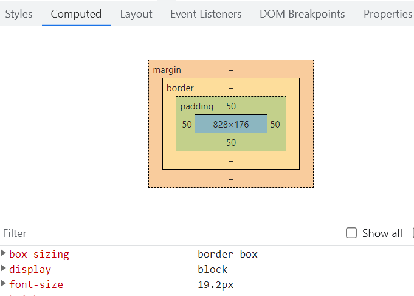

### Units ans sizes

Little experiment about units and sizes.

You already should be familiar with :

- px (absolute size unit. Ultimately, all sizes in a page are computed in px at the end)
- % (always dependent on the parent element)
- rem (size relative to the root size. By default it's 16px, but we can change it)
- vw (responsive size relative to the width of the viewport)
- vh (responsive size relative to the height of the viewport)

Let's go for it !

- Same thing as always : create folder and index.html and styles.css, link the css.
- Little reset (no margins, box sizing : border box)
- Create a boilerplate in the HTML. Inside the body, create a div with class `blabla`
- Inside the div, create a paragraph with lorem250 (emmet)
- In the CSS, give `blabla` a pink background and a minimum height of 50vh
- Play with the browser window dragging it to change the height and width of the viewport
- You'll see that the div (represented by the pink background) will always take 50% of the viewport height.
- Now, let's add some text to the paragraph with lorem1000.
- Wooow ! That's a lot of text.
- You can see the div height adjusted to contain the text. (if you have a big high resolution screen, reduce the window height to see the result)
- Now, give the class a max-height of 75vh.
- Now, the max height of the div limits its size and the text overflows !!!!
- One solution could be :
  - `overflow: hidden;`
- Do it and see the result.
- The text is cut ! That's not always what we want, but it can be very usefull in other situations.

---

- Now let's play with the percentage
- Delete the paragraph inside `blabla`
- Create another div after the first one with class `i-am-the-boss`
- Make it background cyan.
- Do you see it ? No. Because there is no content. A div only takes the space of its content.
- Now make a paragraph inside it with lorem 100
- Give somme padding to the paragraph
- make the font-size 1 rem
- Did it change something ? No. Because the root font size was already by default 16px, and when we stipulate 1rem we are just saying that we want 1x the root font size.
- Now give ir a font size of 1.2 rem.
- Inspect the element and go to the "computed" tab. This tab gives you all final result of what is in your page.
- You can see the computed font-size is 19.2px. Which is 16px \* 1.2. Got it ?

- Now create a new div bellow with class `hello-world` after `i-am-the-boss`
- put a paragraph lorem150 inside of it
- See the font-size ? It's by default 1rem (16px) and it's smaller thant the paragraph above (which is 1.2rem)
- Now let's select the html element in our CSS and reset the root size.
  `html {font-size:30px}`
- Both texts got bigger !
- Inspect it and see that the 1.2rem paragraph is now 36px (30px \* 1.2) and the 1rem pagraph is 30px as we set the root size to be.
- Very usefull to responsive designs !
