## The amazing world of Flex !

---

Hey there !!!! Congratulations on your progress !

Try to see what you accomplished in just 6-7 days of work ! That's amazing !

---

CSS can be harsh ! Lots of different ways to accomplish the same result. A layout logic that isn't the most intuitive…

Two display properties arrived some years ago to facilitate our layout manipulations : Flex and Grid.

In this article, let's tackle the Flex display property.

Little recap of the `display` properties we saw already :

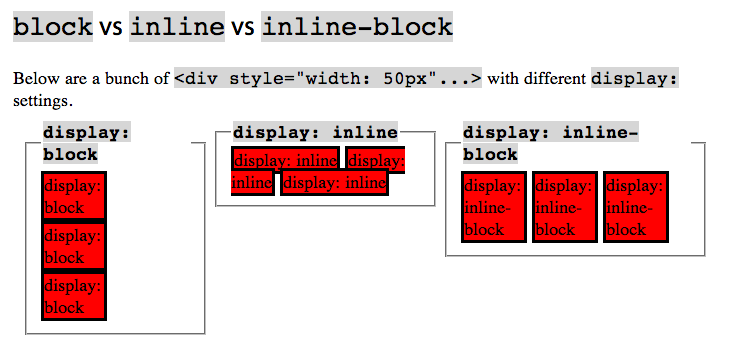

Now let's see the `display: flex;`

#### What is it ?

Flexbox is a one-dimensional layout method for laying out items in rows or columns

#### It's new(ish)

Flexbox is a recent addition to CSS, included to address common layout frustrations

#### Why "Flex" ?

Flexbow allows us to distribute space dynamically across elements of an unknown size, hence the term "flex".

#### The flex model

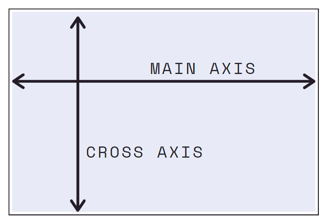

#### Flex directions

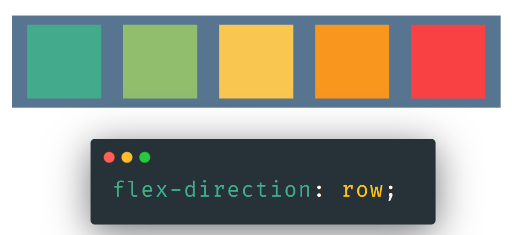

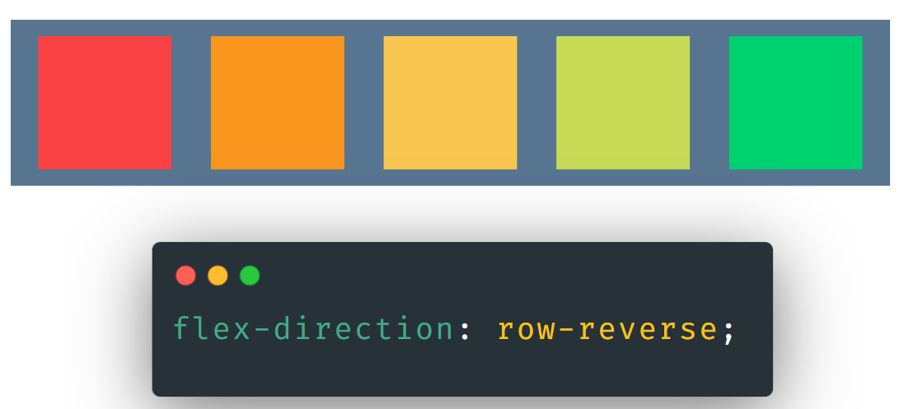

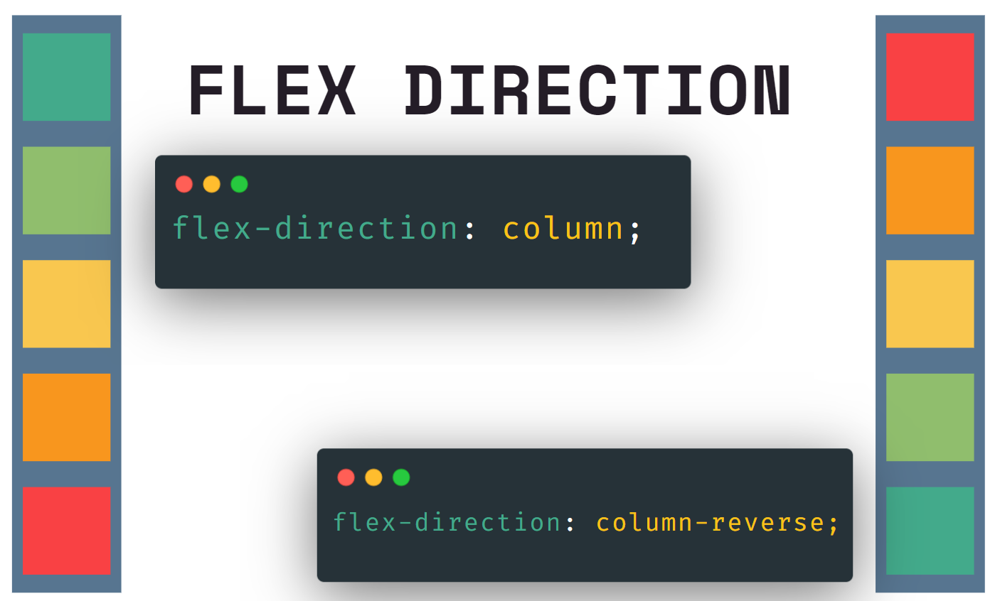

#### Flex wrap

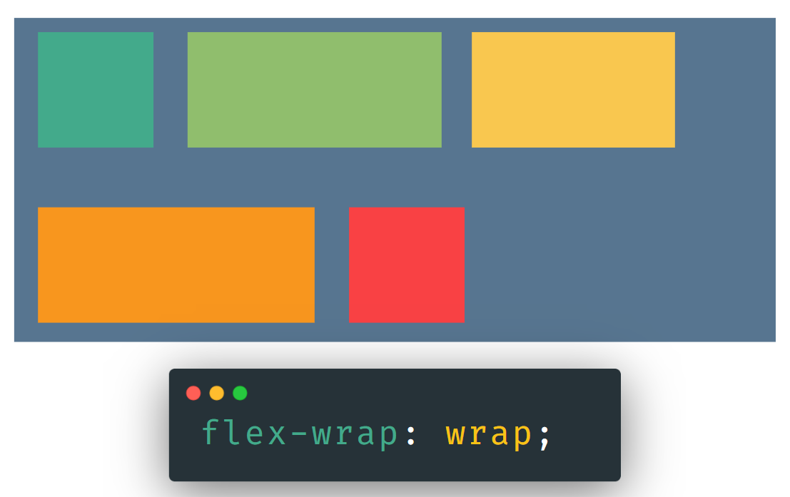

#### Flex Justify Content

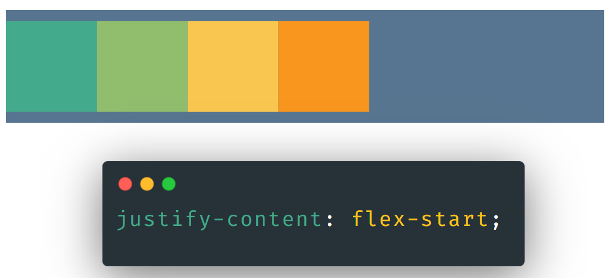
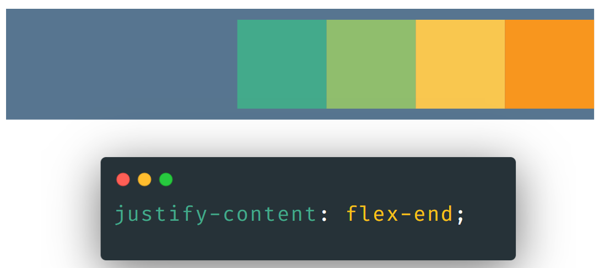
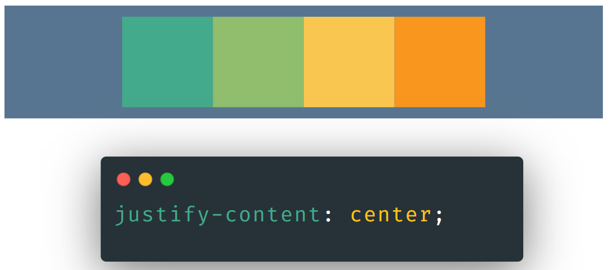
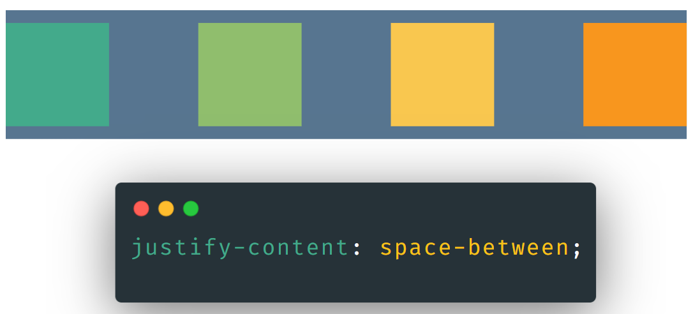
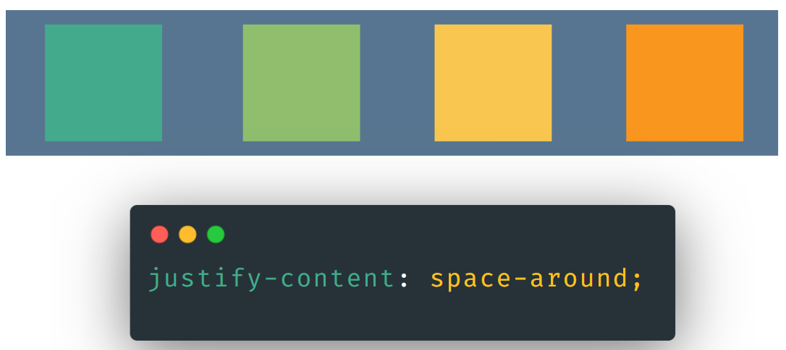

#### Align items

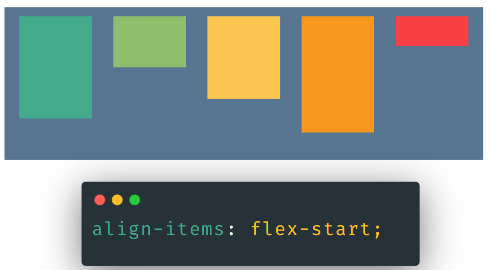
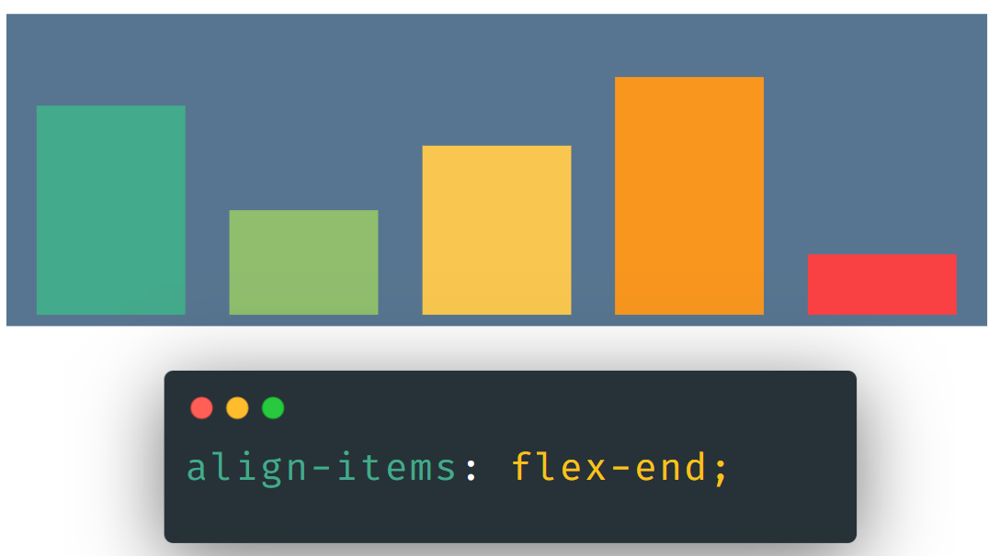
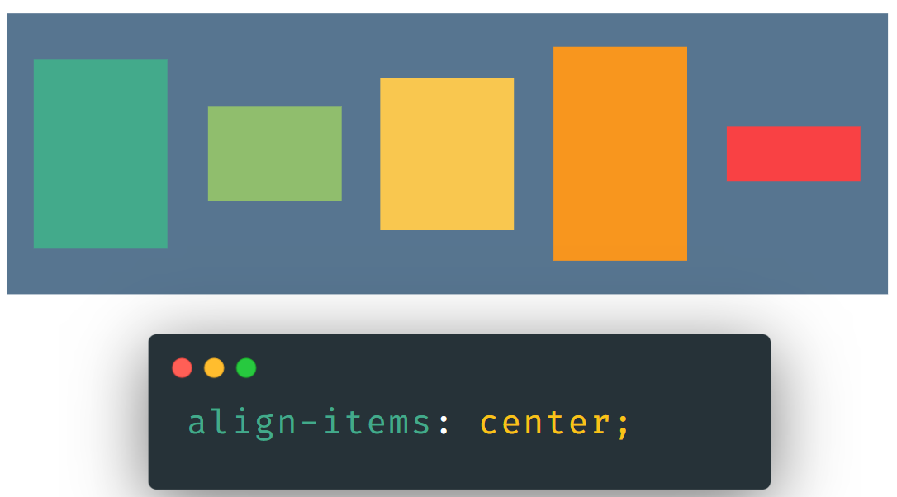
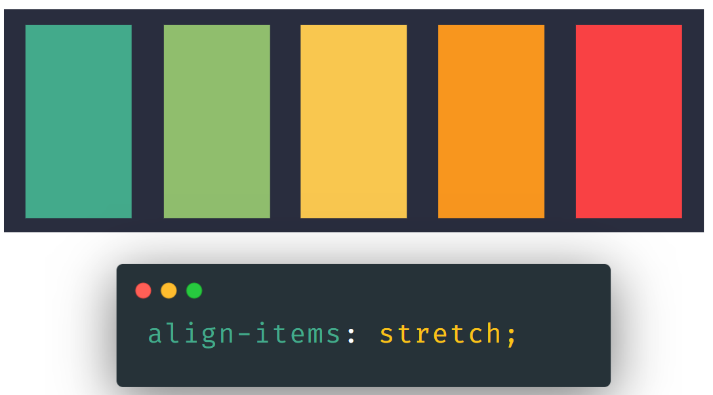

#### Align self

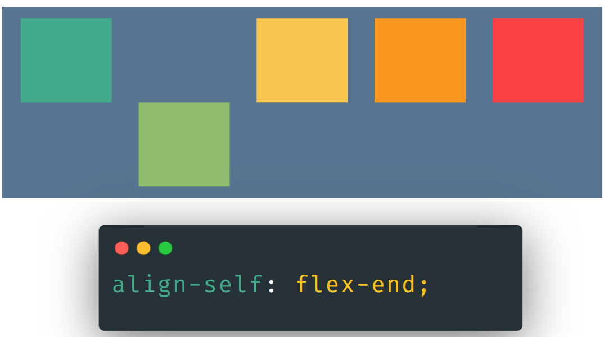

---

## Flex sizing properties

### flex-basis

Defines the initial size of an element before additional space is distributed.

### flex-grow

Controls the amount of available space an element should take up. Accepts unit-less number values.

### flex-shrink

If items are larger than the container, they shrink according to flex-shrink.

---

Spend time on flex ! It can be your best friend !

Practice with these ressources :

[Flexbox Froggy](https://flexboxfroggy.com/)
[Flex interaction](https://codepen.io/enxaneta/pen/adLPwv)

And then... go to the next exercise ;)
