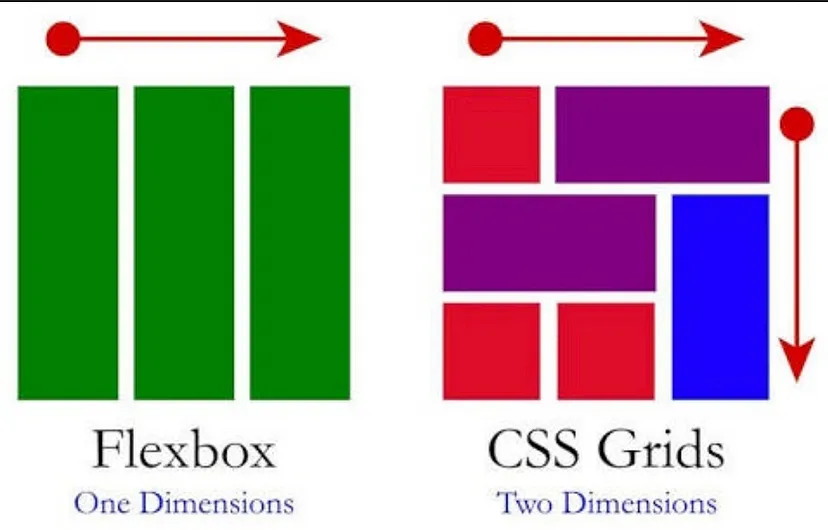

# CSS Grid

---

Another recent(ish) display property is grid. It also facilitates our use of layouts - like flex - but this time it's in two dimensions !

#### Definition

The CSS Grid Layout Module offers a grid-based layout system, with rows and columns, making it easier to design web pages without having to use floats and positioning.

#### Difference between FLEX and GRID

#### Ressources

- [Awesome website for all CSS](https://web.dev/learn/css/grid/)
- [Little cheat sheet](https://grid.malven.co/)
- [W3School](https://www.w3schools.com/css/css_grid.asp)

#### Exercises

- Complete the path of the [Grid Garden](https://cssgridgarden.com/)

- Reproduce this wonderful Mondrian painting with divs and grid. (Center it in a full width and height body with color #212121)

- Reproduce this [Figma Design](https://www.figma.com/file/Kdm7iqwNxpQkgWWkdJnBqO/Exercise-3---CSS-GRID?type=design&node-id=0%3A1&mode=dev). It's not YET a complete website, but we are getting closer !

---

