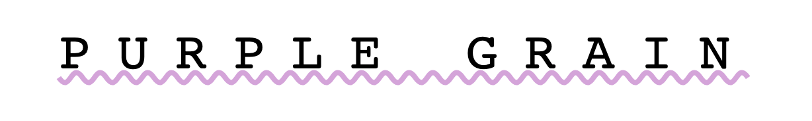
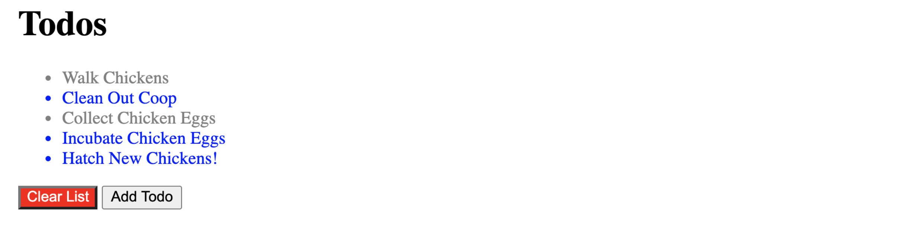
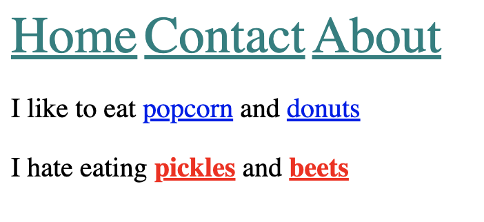
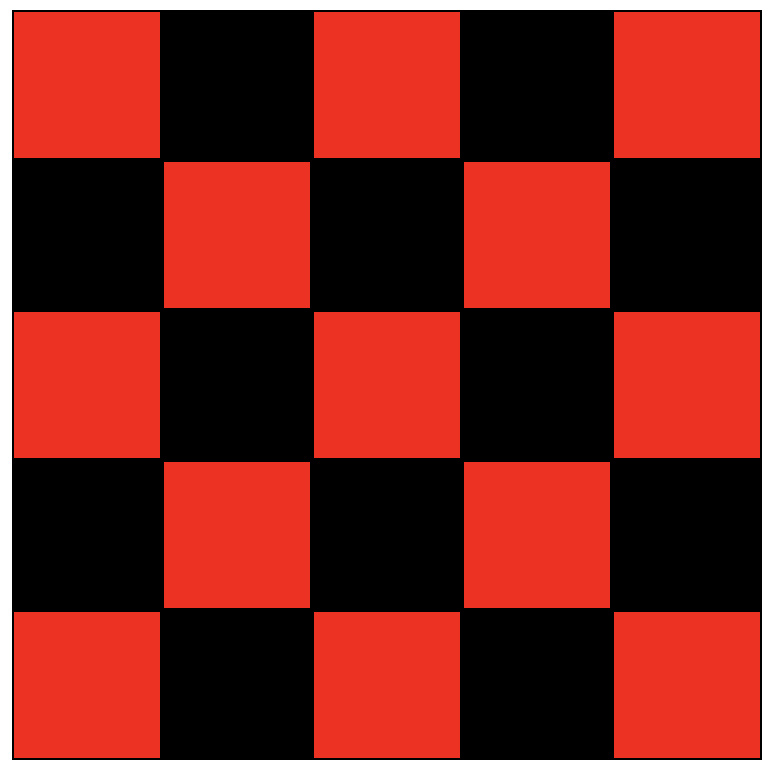
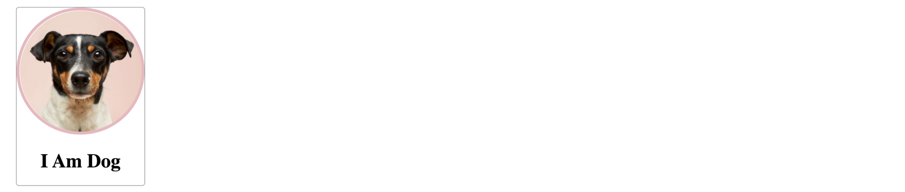

# CSS EXERCISES

## EX1

Rules :

- all H1 are green
- all H2 are red
- paragraphs are white whith black background
- buttons have red text with pink background

## EX2

Style the H1 as so :

- uppercase all the letters, without touching the html!

- set the font to be 'monospace'

- center align the text

- set the font weight to 100

- make the text size 40px

- set spacing between letters to 20px

- add a wavy plum underline (plum is the color)

## EX3

- Give all li elements the text color blue

- Give all elements with the class of done the text color grey

- Give the element with the id clear a red background and white text

## EX4

Give only the links in the header :

- font size of 30px

- color of teal

Give only the links inside the paragraph with the id 'dislikes' :

- bolded
- color of red

## EX5

Please create a simple checkerboard pattern by making the even squares black and the odd squares red. Your result should look like the image below. Please write your styles inside the space I provided, and do not change any other style :)

Please note: the solution needs to select both the even and odd squares, changing the background color of the entire board will work visually, but will not pass the exercise parameters.

## EX6

Recreate the following image with the instructions given above :

Apply the following styles:

The card div

- 210px width

- 1px grey border (solid border-style)

- 5px border radius

- center text aligned

The image

- 200px wide

- 5px border with color of rgb(236, 183, 191) (solid border-style)

- 50% border radius
