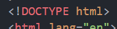
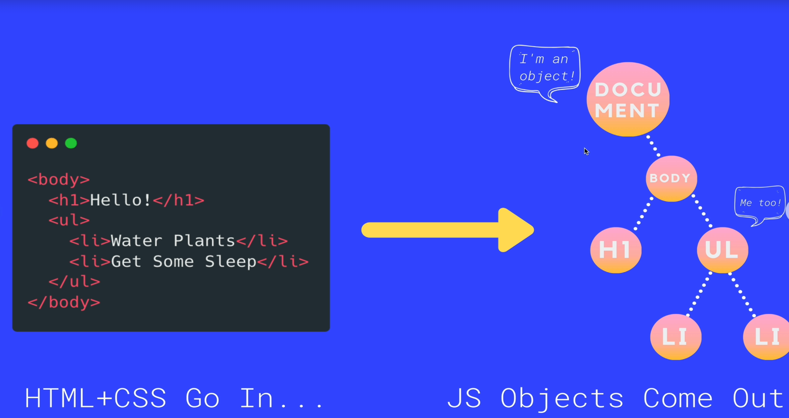
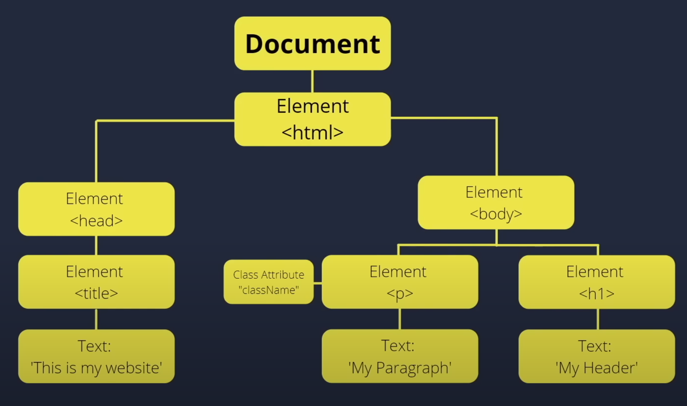

# The DOM

---

Heeeeellooooooowww there !!!

Ready to tackle this new week ?

We are about to dive deep into the **D**ocument **O**bject **M**odel.

Which is a fancy way of saying : we are going to manipulate our HTML and CSS from within JavaScript !

This is huge !

For the first time, we will be able to get dynamic content inside our web pages.

Until now, all the content on your web page was static. This means : the texts that appeared on your page was hard coded into the html, the images you called on your web page were hard coded as well, the classes... No interaction was possible !

Let's change that, shall we ?

---

### What is the Document Object Model ?

Let's unravel this :

**Document**

Have you heard about the "document" ?

Of course you have ! It's the html document we work with.

Remember this ?

This is the piece of markup we write down to establish the html document we will work with.

**Object model**

We studied objects in JavaScript and how they work. Well, what we mean with `object model` is that we are applying the stucture (the model) of objects to the html document content.

---

Look at this diagram :

When we load an HTML page with all its structure, the browser "converts" it to a bunch of objects related one to another.

Therefore, the `window` object is what represents your browser. It's at the top of the hierarchy.

The `window` object has plenty of attributes and methods. For example :

`window.innerWidth` is the attribute whose value is the amount of pixels the width of the window takes at a given time.
`window.alert()` is the method that creates an alert in the browser.
`window.prompt()` is a method as well.

We've using these two methods. We just don't put `window` in front of it, because the `window` is the root object and therefore we can call all its methods natively.

Child to the `window` object there is the `document` object.

Inside of this one, lives the `body` object (the body tag in html) and inside of it all its children (`h1`s, `div`s, etc.)

---

The `document` object is our entry point into the world of the DOM. It contains representations of all the content on a page, plus tons of useful methods and properties.

It's created automatically by the browser when we enter in a page.

Want to access the DOM tree (the objects inside the document object) ?

Go to a website you did (the ultimate exercise for example) and go to the console. There, type `console.dir(object)`

You will see that it prints the document object and inside of it, you can check all its attributes and methods.

THERE ARE A BUNCH !!!! Don't worry ! You will never need to know all of them. Most of them are attributes and methods that the browser needs to itself.

---

A good way of thinking the DOM is a "hierarchical node tree", with the document being the parent and all its elements being their children :

---

In the next chapter, let's dive into DOM elements selection. How can we select elements of the DOM to be able to change their content and behavior ?

See you there ;)

---

Before you go... Watch this 4 minutes [video](https://youtu.be/KShnPYN-voI?si=bnmkPg_bdQ8wzlEu)
