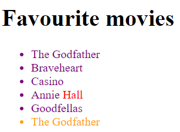

# DOM : Changing elements content.

---

You probably noticed that almost all HTML tags have a text content inside.

Can you tell me what's the text inside of :

```html
<p>Hello World</p>
```

Ok... that was easy.. `Hello World`

And now : ?

```html
<p>Hello <span>World</span></p>
```

Well... the text is the same. `Hello World`

But the `html` inside of the `p` is :

```html
Hello <span>World</span>
```

Got the difference ?

---

We will introduce you to two properties of almost any DOM element :

```
innerText;

innerHTML;
```

This is, as I said, a property. Not a method. You can check and reassign this property to anything you like.

---

#### Little exercise

Still with the boilerplate provided :

```html
<div class="container">
  <h1 id="main-heading">Favourite movies</h1>
  <ul>
    <li class="list-item">The Godfather</li>
    <li class="list-item">Braveheart</li>
    <li class="list-item">Casino</li>
    <li class="list-item">Annie Hall</li>
    <li class="list-item">Goodfellas</li>
  </ul>
</div>
```

- Check what is the `innerText` of the first `li.list-item` and assign it to a variable.
- Create another `li` element.
- Set the inner text of this **last** `li` to be equal to the **first** `li`.
- Append the new `li` tag to the list.
- Now, give **all** the `li` the color `purple`
- Then, give the **last** `li` the color `gold`
- Now, make sure the word `Hall` from `Annie Hall` is `red`

**DON'T TOUCH the HTML or CSS**. Everything should be done with JavaScript.

Your result should be :



---

Want a video ?
[Here](https://youtu.be/hDN5IGUv3Yw?si=Jd4IFfedMUOI1mwv)
