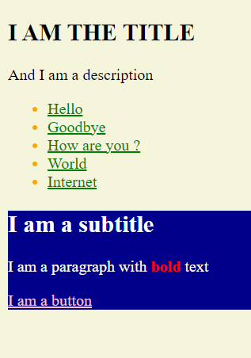
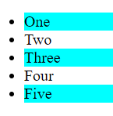
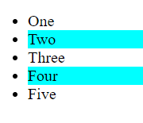

#### Exercise 1

Given this HTML markup :

```html
<body>
  <section class="part-1">
    <div class="container">
      <h1>I am the title</h1>
      <p>And I am a <span>description</span></p>
      <ul>
        <li><a href="#">Hello</a></li>
        <li><a href="#">Goodbye</a></li>
        <li><a href="#">How are you ?</a></li>
        <li><a href="#">World</a></li>
        <li><a href="#">Internet</a></li>
      </ul>
    </div>
  </section>

  <section class="part-2">
    <div class="container">
      <h2>I am a subtitle</h2>
      <p>I am a paragraph with <b>bold</b> text</p>
      <a href="#" class="myBtn">I am a button</a>
    </div>
  </section>
</body>
```

and given this starter JavaScript code :

```js
const bold = document.querySelector("b");
```

Make the following arrangements with only JavaScript :
(each line of code should start with the variable `bold`... The code will be discusting, but.. hey ! it's an exercise)

- the body should have a background color of `beige`
- the bold itself should be `red`
- the **_part-2_** div should have a `darkblue` background and a `white` color.
- The anchor tag in **_part-2_** should be `pink`
- all `li` in **_part-1_** should be `orange`
- All `a` inside the `li`s should be `green`
- Finally, the `h1` should be uppercase.

Your beautiful result should be :



---

#### Exercise 2

With this markup :

```html
<body>
  <h1>No buttons here</h1>
  <div class="container"></div>
</body>
```

- Use JavaScript to generate exactly 100 buttons and append it to the `container` div.

- Inside each button there has to be a text "I am button 1", 2, 3, 4 etc.

- Also, change the `h1` text to `There are a lot of buttons here !`

- Lastly... make the buttons appear and the text changes only after 2 seconds (we saw `setTimeOut()` already)

---

#### Exercise 3

Given this markup :

```html
<ul>
  <li class="highlight">One</li>
  <li>Two</li>
  <li class="highlight">Three</li>
  <li>Four</li>
  <li class="highlight">Five</li>
</ul>
```

and css :

```css
.highlight {
  background-color: cyan;
}
```

Use javascript to inverse the highlighted list elements.

So, from this :



It should become this :



Don't overcomplicate this !!!!!

---

#### Exercise 4

Let's use an API (a veeeery simple one)
You can get images of Pokemon through this url :

https://raw.githubusercontent.com/PokeAPI/sprites/master/sprites/pokemon/1.png

See the `1.png` at the end ? This is the image of pokemon 1. You can go through 2, 3, 4, etc. untill 151.

Giver this markup inside the body :

```html
<h1>Pokemon</h1>
<div class="container"></div>
```

Use JavaScript to :

- Create an image tag for each Pokemon and append it to the container
