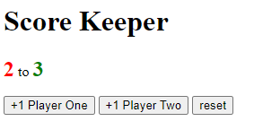

## Exercise : Score Keeper

---

Let's do something a little bit more complex.

We are going to create a "score keeper".

Let's say you are playing ping-pong with your friend and you are playing "best of 5". That means : after 5 games, the player that won the most games gets the trofy.

You want to create a program that counts how many games `player 1` wins and how many games `player 2` wins.

We will do this trough buttons.

There is a button for each player that increments the score.

When we arrive at 5 total games, the buttons are disabled (we can't click them anymore). And the score of the winner becomes green and the color of the loser becomes red.

Then, you can click on a button `reset` to start all over again.

Good luck young padawans !
