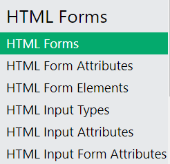

# HTML forms

---

Ok, you might have noticed that when we studied HTML some weeks ago, we didn't really talk about `forms`.

Let's tackle this now, shall we ?


---

Forms are the entry point for interactivity with the user.

Think of all the times you had to enter in a website (or app) : a number, a text, make a choice between some options...

We can perform so many things with forms !

- login / register forms
- search boxes
- acceptance of terms and services
- contact forms
- surveys
- etc.

Forms work with `input` fields. These are fields where you can enter data that will be processed on submission.

Traditionnaly, there are two ways to submit data through a form. These are the methods `GET` and `POST`.

Don't worry. You don't have to deeply understand this for now. But basically, with the GET method, you pass to the browser some data that the app (website) can use.

Let's do that :

Go to YouTube and enter in a specific video page. Now, look at the URL.

You should see something like that :
`https://www.youtube.com/watch?v=2O8pkybH6po&ab_channel=BroCode`

So... we have our base URL `https://www.youtube.com/watch` then we have a `?`
From this `?` we have several key/value pairs that stipulate specific data.

In this case we have :

```
v = 2O8pkybH6po
and
ab_channel = BroCode
```

That's what we call a `query string`. It starts with a `?` and then it gives us key/value pairs with the data we need.

YouTube uses this browser information (data) to know what video it will look for in the database and then stream it to you.

Let's try this for our selves :

In an HTML file, write down :

```html
<form method="GET">
  <p>What is your cat's name ?</p>
  <input type="text" name="cat" />
  <p>Tell me how old is he</p>
  <input type="number" name="age" />
  <br />
  <button type="submit">Send</button>
</form>
```

Now, fill in the information and click "Send".

Now, look at your URL !

See... key/value pairs giving us some data. With JavaScript, we can then read this query string and perform actions depending on it.

The `name` attribute in an input is what gives us the key of the key/value pair

But that's a little far away.

---

Another thing is the `action` of a form. It's where this form will be submitted to. It will lead us to a specific url where, suposably, the form data will be processed. If you don't put anything, the `action` will be the page itself.

You can see that when you submit the form, the page refreshes.

I am just giving you some pieces of information so you can understand them better later.

For now... Let's get back to the basics of `forms`

---

My strong advise is to watch this 31 minutes tutorial from the excellent Shaun from Net Ninja. [here](https://youtu.be/YwbIeMlxZAU?si=-B9KrdNAFUALn-oH)

If you don't feel like it, try to watch at least this 8 minute video : [here](https://youtu.be/2O8pkybH6po?si=hleZ7hE98clN_FJU)

[Here](https://www.w3schools.com/html/html_forms.asp) is an excellent documentation about forms. (Pay attention that there are several articles )



---

Do some experiments yourself with the `GET` method in order to see all your inputs being displayed in the query string.

Try to use all kinds of inputs there are.

- input:text
- input:number
- input:checkbox
- input:email
- input: file
- select
  - option
- textarea
- etc...

We will soon make an exercise to validate a contact form. ;)
