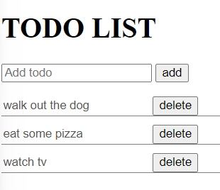

# Exercise : TODO list with local storage

---

With this, let's tackle a project that has never been done by any developer yet : a TODO LIST !!!!

Try to reproduce this ux :

So :

- One input where you can write the task
- A button to `add` it.
- Each task should occupy a row with a button `delete`
- Of course : save to local storage and update it

---

Done ?

**GREAT** ! Did you know you just performed your first `CRUD` operation ?

CRUD stands for **C**reate **R**ead **U**pdate and **D**elete.

These terms describe the four essential operations for creating and managing persistent data elements.
