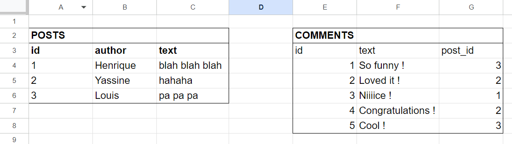

# Databases

---

Hey there ! :)

Hope you're fine and motivated !

Today we are going to start learning about databases. The missing piece of what we've been doing these last weeks.

In our exercises, you realized our data was not persistent.

We created an empty array that is declared each time our server restarts. It's obvious why this can't work in real life. We need a way to save and persist data !

---

Now, you may ask me : Why do we need a database, if we could just save data into a file (txt, etc.) ?

We indeed could use a simple text file to save our data. But in scalability, this could become huge, non-performant and not secure.

Databases are designed to manage a huge amount of data in an efficient way. Moreover, there is a whole security part (privileges, admin, etc.) embeded to it, which are crucial for large scale applications.

---

#### Different types of databases : SQL vs NoSQL

SQL databases (mySQL, MariaDB, SQLite, etc.) :

- Work with tables (think a little bit about Microsoft Excel or Google Sheets).
- They are relational databases. (one table can be linked to another so there is no repetition of data)
- We predefine a schema of tables before we insert anything.

Ok... may be not so clear... Let's check this out (made in google sheets just for example):

You see ? We have two tables : one for the posts of a blog, another one for the comments.

For each table, we have to predefine what kind of data will be inserted for each new entry (we call this a **schema**).

For example, here, there must be :

**Posts**

- ID - integer;
- author - string;
- a text content - string;

**Comments**

- ID - integer
- text content - string
- post_id - integer

You could not add in a request a "picture" column for example on the fly if you whish. All of this must be pre-established.

This last one (post_id) is the **relational** part of the tables. It refers to another table, so we can **link** one block of data to another.

That's how SQL works.

SQL is also considered a language itself (very small indeed, yet very powerful). Actually, it stands for `Structured Query Language`

There are some commands we will learn very soon to query the database, update it, delete, etc.

---

In its counter part, there is the **NoSQL** databases. Which means exactly that : **_It is NOT SQL_** :P

The way of saving and storing data with NoSQL databases are a little different.

They work more like objects JSON.

[Here](https://www.astera.com/knowledge-center/sql-vs-nosql/) is a little text from the website of Oracle explaining and comparing SQL and NoSQL.

---

Now... here are the content and exercises for today (ending tomorrow) :

- **Introduction to SQL.**

[What is SQL](https://youtu.be/27axs9dO7AE?si=0D1kWTjeXTvy9d0v) (4min)

[SQL explained in 100 seconds](https://youtu.be/zsjvFFKOm3c?si=uSpJ4VjHFrAeuPw7)

[SQL Crash Course](https://youtu.be/p3qvj9hO_Bo?si=fhY5XAHIWXnxSPoB) by WebDev Simplified

Here is the list of exercises :
It's a [repo](https://github.com/WebDevSimplified/Learn-SQL) on GitHub with several interesting exercises and its solutions.
